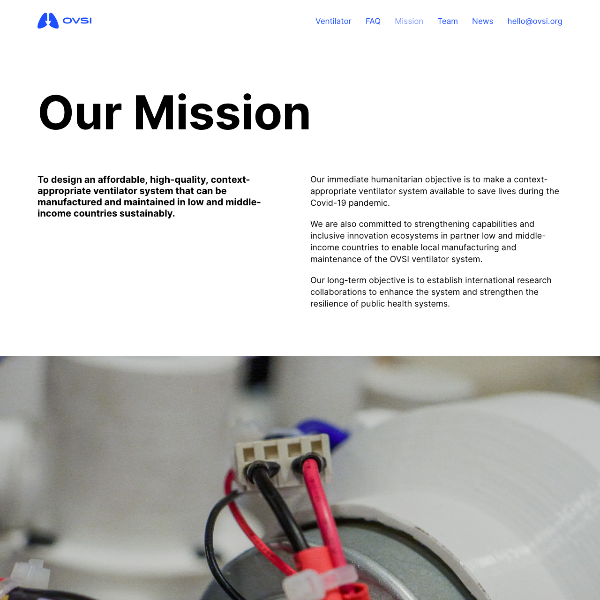

import ImgVertical from '~/components/ImgVertical.vue'

# This is a case study for OVSI

The Open Ventilator System Initiative (OVSI) was started at the University of Cambridge in response to the Coronavirus pandemic.

<ImgVertical color="ovsi1.png" />

In a matter of weeks a team of engineers designed a sophisticated ventilator that costs under $1000 and is simple to build from parts that can be sourced anywhere in the world.

